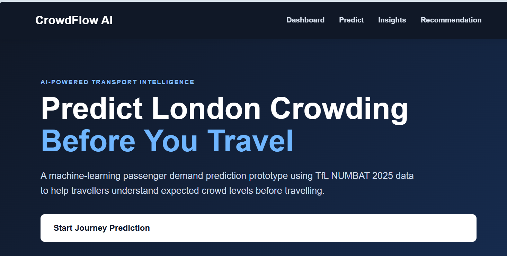
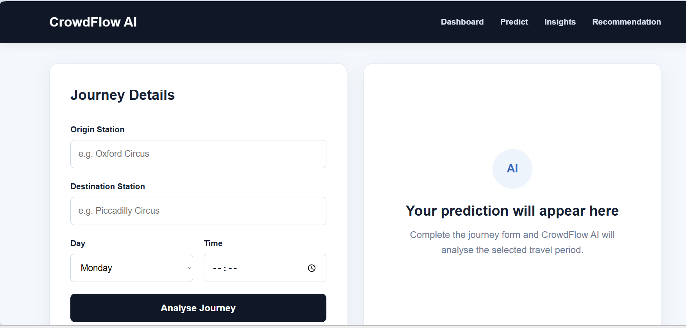

# 🚇 CrowdFlow AI

### Machine Learning-Based Passenger Demand Prediction for London Public Transport

CrowdFlow AI is a machine learning-powered web application designed to predict passenger demand across London's public transport network using historical Transport for London (TfL) NUMBAT data.

The system uses a **Random Forest regression model** to analyse journey information such as origin station, destination station, Underground line, direction, day type and travel time.

Users can enter their journey details through a Flask-based web interface and receive:

- 📊 Estimated passenger demand
- 🚦 Crowd level classification
- 💡 Travel guidance based on predicted demand

## 🔗 Live Project

**Live Demo:** https://crowdflow-ai-8f85.onrender.com

**GitHub Repository:** You are currently viewing the source code for CrowdFlow AI.
## 🛠️ Tech Stack

### Backend & Machine Learning
- **Python** – Core programming language
- **Flask** – Web application framework
- **Scikit-learn** – Machine learning model development
- **Random Forest Regressor** – Passenger demand prediction
- **Pandas** – Data preprocessing and manipulation
- **Joblib** – Model serialization and loading

### Frontend
- **HTML5**
- **CSS3**
- **Jinja2**

### Development & Deployment
- **Git & GitHub** – Version control and source code management
- **Render** – Cloud deployment
- **Gunicorn** – Production WSGI server

### Data
- **TfL NUMBAT** – Historical London public transport passenger demand data

## ✨ Key Features

- 🚇 **Journey-Based Prediction** – Users can select an origin station, destination station, Underground line, direction, day type and travel time.

- 🤖 **Machine Learning Prediction** – Uses a trained Random Forest regression model to estimate passenger demand from historical transport data.

- 👥 **Crowd Level Classification** – Converts predicted passenger demand into easy-to-understand crowd levels.

- 💡 **Travel Guidance** – Provides guidance based on the predicted level of passenger demand.

- 🌐 **Web-Based Interface** – Flask-based application allows predictions to be generated through a simple browser interface.

- 📊 **Historical TfL Data** – Built using Transport for London NUMBAT passenger-demand data.

- ☁️ **Cloud Deployment** – Application is deployed on Render and accessible online.

## 📈 Model Performance

The Random Forest regression model was evaluated using standard regression metrics:

- **R² Score:** 0.594
- **Mean Absolute Error (MAE):** 146.34 passengers
- **Root Mean Squared Error (RMSE):** 293.75 passengers

The R² score indicates that the model explains approximately **59.4% of the variance** in passenger demand within the evaluated dataset.

> Note: The model was trained on a subset of the available processed data because of local computational limitations during development.


## ⚙️ How CrowdFlow AI Works

CrowdFlow AI follows a simple end-to-end machine learning workflow:

1. **Journey Input**  
   The user provides journey information including origin station, destination station, line, direction, day type and travel time.

2. **Input Preprocessing**  
   The Flask application processes the submitted journey information and converts it into the format required by the trained machine learning model.

3. **Passenger Demand Prediction**  
   The processed input is passed to the trained **Random Forest regression model**, which generates an estimated passenger demand.

4. **Crowd Classification**  
   The predicted passenger demand is converted into a crowd level to make the result easier for passengers to understand.

5. **Travel Guidance**  
   The web application displays the predicted demand, crowd level and relevant travel guidance to the user.

### System Flow

`User → Flask Web Application → Input Preprocessing → Random Forest Model → Passenger Demand Prediction → Crowd Level → Travel Guidance`
## 🖥️ Application Screenshots

### CrowdFlow AI Dashboard

The dashboard introduces the CrowdFlow AI passenger demand prediction system and provides access to the prediction and analysis features.



### Journey Prediction

Users can enter their origin, destination, day and travel time to generate a passenger demand prediction and crowd-level assessment.




## 📁 Project Structure

```text
CrowdFlow-AI/
│
├── data/
│   ├── inspect_data.py
│   ├── inspect_numbat.py
│   └── prepare_numbat.py
│
├── models/
│   ├── compress_model.py
│   ├── random_forest_model.pkl
│   ├── test_model.py
│   └── train_model.py
│
├── screenshots/
│
├── static/
│   └── css/
│
├── templates/
│
├── app.py
├── requirements.txt
├── .gitignore
└── README.md
## 🚀 Installation & Local Setup

### 1. Clone the repository

```bash
git clone https://github.com/rudra112p/crowdflow-ai
cd crowdflow-ai
```

### 2. Create a virtual environment

```bash
python -m venv venv
```

Activate it on Windows:

```bash
venv\Scripts\activate
```

On macOS/Linux:

```bash
source venv/bin/activate
```

### 3. Install dependencies

```bash
pip install -r requirements.txt
```

### 4. Run the application

```bash
python app.py
```

### 5. Open the application

Open your browser and visit:

```text
http://127.0.0.1:5000
```

The trained Random Forest model is loaded by the Flask application to generate passenger demand predictions.

## 🔮 Limitations & Future Improvements

CrowdFlow AI is a functional prototype developed using historical TfL passenger demand data. Several improvements could extend the system further.

### Current Limitations

- Predictions are based on **historical TfL NUMBAT data** rather than real-time passenger information.
- The model does not currently account for live disruptions, weather, special events or unexpected changes in passenger behaviour.
- Due to local computational limitations during development, the Random Forest model was trained using a subset of the processed dataset.
- The current system is intended as a decision-support prototype rather than a real-time TfL journey planning service.

### Future Improvements

- Integrate real-time TfL transport and disruption data.
- Explore additional machine learning models and hyperparameter optimisation.
- Train and evaluate models using larger datasets and greater computing resources.
- Incorporate additional features such as weather, events and service disruptions.
- Improve the user interface and provide richer passenger-demand visualisations.

- ## 👨‍💻 Author

**Rudra Patel**

BSc (Hons) Computing with Technology graduate with an interest in software engineering, backend development and machine learning.

### Connect with me

- **LinkedIn:** PASTE-YOUR-LINKEDIN-URL
- **Portfolio:** PASTE-YOUR-PORTFOLIO-URL
- **GitHub:** https://github.com/rudra112p
